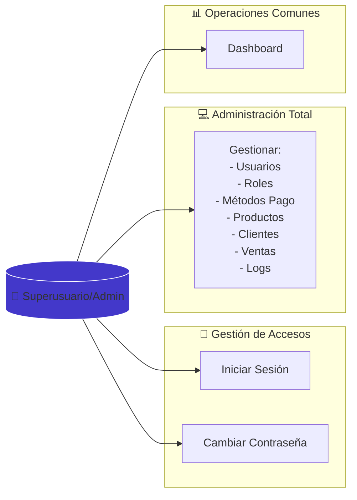
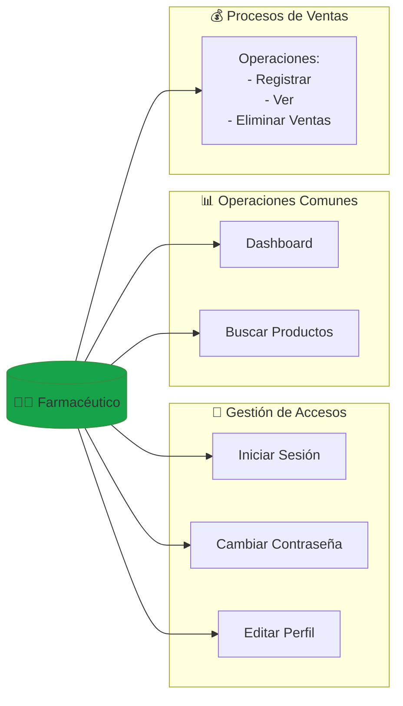
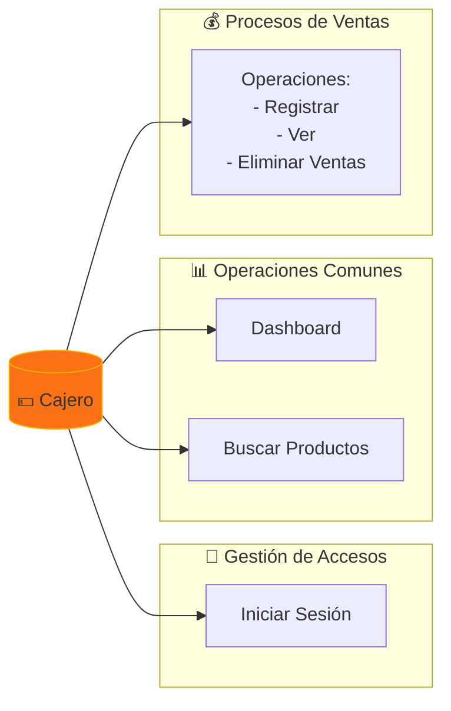
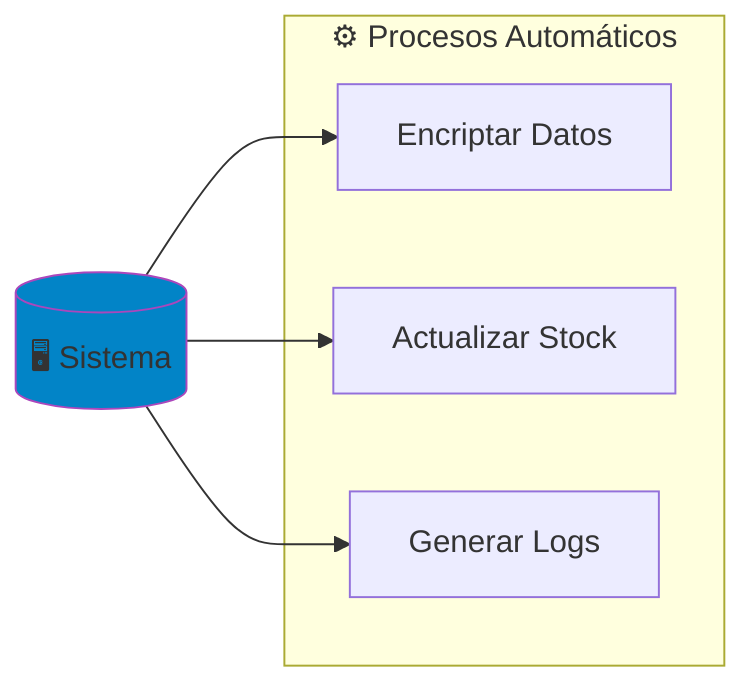
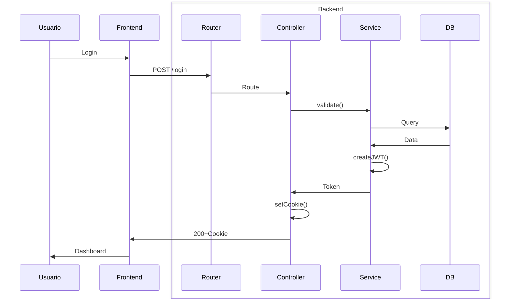
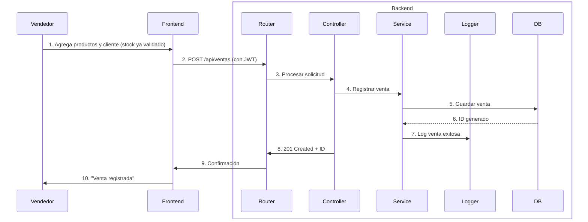
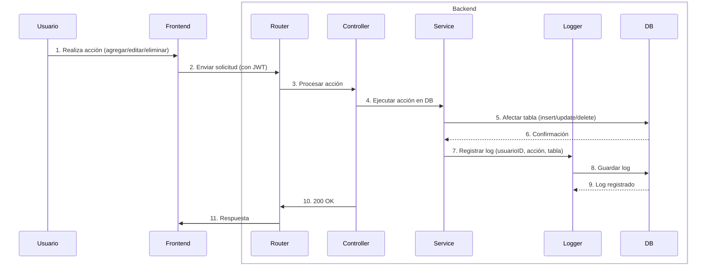
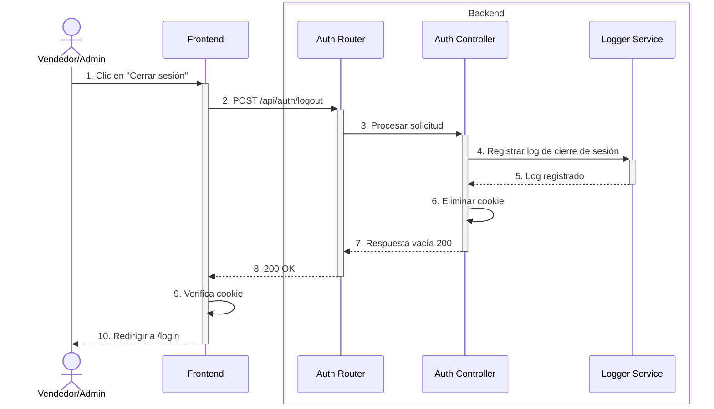
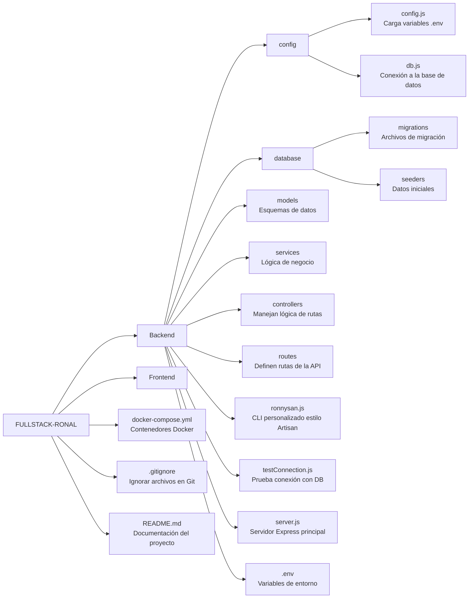
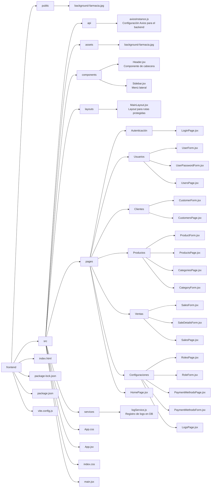

# **💊 Problema Actual de la Botica "Nova Salud"**  


❌ **Gestión manual ineficiente**  
- 📉 **Inventario desactualizado**: Registros en papel o Excel → desabastecimiento frecuente.  
- 🐌 **Procesos lentos**: Facturación manual y búsqueda de productos retrasa la atención.  
- 💸 **Pérdidas económicas**: Errores en stock y precios afectan rentabilidad.  

<br>

🔍 **Consecuencias**:  
- 😠 Clientes insatisfechos por largas esperas.  
- 💊 Medicamentos vencidos o faltantes no detectados a tiempo.  

---

<br>

# **🧩 Solución Propuesta**  

🚀 **Desarrollar un Sistema Fullstack** 

---
<br>


# 📋 Levantamiento de requirimientos

## ✅ **Requerimientos Funcionales**

### **🔐 Autenticación y Seguridad**
#### **1**: **Sistema de autenticación**  
- Los usuarios pueden iniciar sesión mediante credenciales (email y contraseña).

#### **2**: **Encriptación de contraseñas**  
- Las contraseñas se almacenan de manera segura en la base de datos utilizando **bcrypt** para encriptarlas.

#### **3**: **Protección de rutas**  
- El acceso a rutas sensibles del backend está protegido mediante **JWT** (JSON Web Tokens) y cookies con la opción **HTTP-only** para mejorar la seguridad.

---

### **📦 Gestión de Productos**
#### **4**: **Gestión de productos (CRUD)**  
- Los usuarios autorizados (Administrador/Superusuario) pueden **crear, leer, actualizar y eliminar productos**.

#### **5**: **Búsqueda y filtrado de productos**  
- Los productos pueden ser **buscados y filtrados** por nombre, categoría o código de producto.

---

### **👤 Gestión de Clientes**
#### **6**: **Gestión de clientes (CRUD)**  
- Los usuarios autorizados (Administrador/Superusuario) pueden **crear, leer, actualizar y eliminar clientes**.

---

### **💰 Ventas**
#### **7**: **Registro de ventas**  
- El sistema permite **registrar ventas** con los siguientes detalles:  
  - Selección de cliente.  
  - Lista de productos vendidos (incluyendo cantidad, precio unitario y subtotal).  
  - Cálculo automático del **total** de la venta.

#### **8**: **Actualización de stock**  
- El **stock de productos se actualiza automáticamente** al registrar una venta, asegurando la correcta gestión de inventario.

---

### **🖥️ Interfaz de Usuario**
#### **9**: **Dashboard**  
- El sistema presenta un **dashboard** con un resumen de **productos, clientes, ventas, etc.** para facilitar la gestión y supervisión del negocio.

#### **10**: **Diseño intuitivo**  
- La **interfaz de usuario** está diseñada para ser **intuitiva y fácil de usar**, mejorando la experiencia del usuario y facilitando la navegación.

---

### **Responsabilidades por Rol**
- **Superusuario/Administrador**: Acceso a todas las funcionalidades, incluyendo gestión de usuarios, roles, productos, clientes, ventas y logs.
- **Farmacéutico**: Acceso para registrar y visualizar ventas, consultar productos y modificar su perfil.
- **Cajero**: Acceso para registrar y visualizar ventas, consultar productos y visualizar el dashboard.

---

<br>

## 🛡️ **Requerimientos No Funcionales**

### **🔒 Seguridad**
#### **1**: **Cookies HTTP-only**  
- Utilizar **cookies HTTP-only** para evitar ataques de **Cross-Site Scripting (XSS)**, protegiendo las sesiones de los usuarios.

#### **2**: **JWT con expiración corta**  
- El sistema debe implementar **JSON Web Tokens (JWT)** con una **expiración corta** de 1 hora para la autenticación de usuarios, asegurando que las sesiones no permanezcan activas indefinidamente.

#### **3**: **Validación de datos**  
- Validación tanto en **frontend** como en **backend** para asegurar que los datos recibidos no puedan ser utilizados para **inyectar código SQL** o realizar otros tipos de ataques.

---

### **📱 Usabilidad**
#### **4**: **Tiempo de carga de páginas**  
- Las **páginas** deben cargar en menos de **2 segundos** para una experiencia de usuario fluida y rápida.

#### **5**: **Compatibilidad con dispositivos móviles**  
- La interfaz debe ser **responsiva**, garantizando la correcta visualización y usabilidad en dispositivos móviles y tabletas.

---

### **🧰 Mantenibilidad**
#### **6**: **Uso de migraciones y seeders**  
- Implementar **migraciones** y **seeders** (scripts como "ronnysan") para la **inicialización de datos de prueba**, permitiendo una gestión eficiente de la base de datos.

---

### **⚙️ Rendimiento**
#### **7**: **Soporte de usuarios concurrentes**  
- El sistema debe soportar al menos **10 usuarios concurrentes** sin experimentar **degradación notable en el rendimiento**, manteniendo la fluidez en operaciones como ventas y gestión de productos.

#### **8**: **Base de datos optimizada**  
- La **base de datos** debe estar optimizada para consultas rápidas, especialmente para operaciones críticas como el registro de ventas y la búsqueda de productos.

---

### **🚀 Despliegue**
#### **9**: **Compatibilidad con entornos Linux/Windows**  
- El sistema debe ser **compatible** con **entornos de despliegue Linux** y **Windows**, para facilitar su implementación en servidores de diferentes plataformas.

#### **10**: **Uso de variables de entorno**  
- El sistema debe utilizar **variables de entorno** para almacenar configuraciones sensibles, como **credenciales de base de datos**, para una mayor seguridad y flexibilidad en diferentes entornos de despliegue.


---

<br>

# 🔷 Diagramas Técnicos

## 🧑‍💻 Diagrama de casos de uso

### 🦸 Super Usuario y Admin


---

<br>


### 👨‍⚕️ Farmaceutico


---

<br>


### 👨‍⚕️ DCU - Cajero


---

<br>


### 🖥️ DCU - Sistema


---

<br>


## ➡️ Diagrama de secuencia
### 🔐 Proceso de login


<br>

---

<br>

### 💳 Proceso de compra




---

<br>

### 🕐 Proceso de logs




---

<br>

### 🚪 Proceso de cerrar sesion


---

<br>

# 🧱 Modelado de Base de datos
🔗 [El modelado en DrawSQL](https://drawsql.app/teams/main-88/diagrams/farmacia-nova-salud)

---

<br>

# 🏗️ Arquitectura del Proyecto

📐 El Patron **MSCR**:  

**Modelo ⬅️ Service ⬅️ Controlador ⬅️ Router**

---

<br>

# 📁 Estructura del Proyecto Backend



---

<br>


# 📁 Estructura del Proyecto Frontend



---

<br>


## 🧑‍💻 Ronnysan CLI (Mi Artisan Personal)

Inspirado en **Laravel Artisan**, creé **ronnysan**, un CLI personalizado para generar controladores, modelos y servicios rápidamente en el backend con Node.js.

<br>

### 📂 Comandos para generar archivos

Aquí algunos ejemplos de cómo utilizar **ronnysan** para crear diferentes archivos en el backend con el modelo `User`:

#### 🧩 Crear un **Model**
```bash
node ronnysan.js make:model User
```
> Crea un modelo User en el backend, que representará la estructura de la tabla users en la base de datos.

<br>

#### 🛠️ Crear un **Service**
```bash
node ronnysan.js make:service User
```
> Crea un archivo User Service que contendrá la lógica de negocio y la interacción con el modelo User.

<br>

#### 🎮 Crear un **Controller**
```bash
node ronnysan.js make:controller User
```
> Crea un controlador User que gestionará las rutas y acciones relacionadas con el modelo User.

<br>

#### 🔗 Crear un **Router**
```bash
node ronnysan.js make:router User
```
> Crea un archivo de enrutador User que define las rutas para las acciones CRUD del modelo User.

<br>

#### 🗄️ Crear una **Migration**
```bash
node ronnysan.js make:migration User
```
> Crea un archivo de migración para la tabla User, que te permitirá crear o modificar la estructura de la base de datos.

<br>

#### 🌱 Crear un **Seeder**
```bash
node ronnysan.js make:seeder User
```
> Crea un archivo Seeder para User, que te permitirá insertar datos de ejemplo o predeterminados en la base de datos.

<br>

### 🚀 Comandos para migraciones
Los comandos de migración nos permiten gestionar la estructura de la base de datos, creando o eliminando tablas según lo definido en los archivos de migración.

#### ⬆️ Ejecutar una **Migracion**
```bash
node ronnysan.js migrate:up usersTableMigration.js
```
> Este comando ejecuta la migración User, lo que construye la tabla correspondiente en la base de datos según lo definido en el archivo de migración.

<br>

#### ⬇️ Revertir una **Migracion**
```bash
node ronnysan.js migrate:down usersTableMigration.js
```
> Este comando revierte la migración User, eliminando la tabla o los cambios hechos en la base de datos.


<br>

### 🌱 Comandos para seeder
Tambien podemos ejecutar seeders con los siguientes comandos:

#### ⬆️ Ejecutar un **Seeder**
```bash
node ronnysan.js seeder:up userTableSeeder.js
```
> Este comando ejecuta el seeder User, lo que inserta datos establecidos en el archivo seeder en la base de datos, como registros de ejemplo para la tabla User.

<br>

#### ⬇️ Revertir un **Seeder**
```bash
node ronnysan.js seeder:down userTableSeeder.js
```
> Este comando revierte el seeder User, eliminando los datos que se insertaron en la base de datos.

---

<br>

# ✅ PROYECTO EN FUNCIONAMIENTO AQUI:
👉 [Ver proyecto](http://localhost:5173/)
