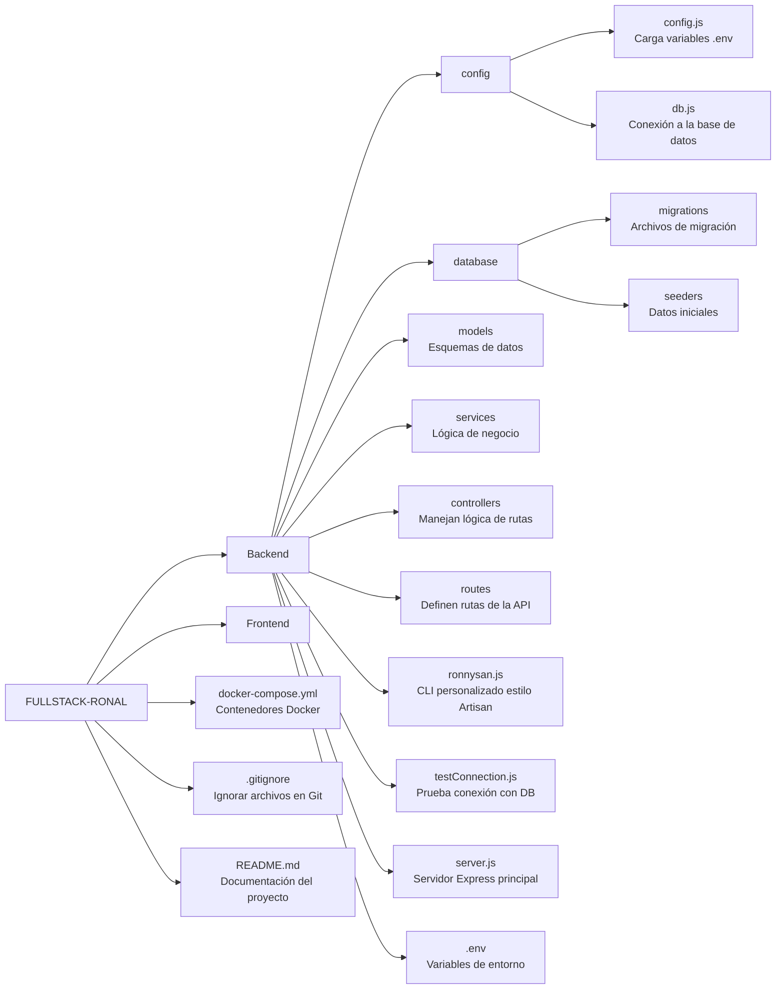

# 🚀 Proyecto Fullstack: **FULLSTACK RONAL TITO**

Este proyecto es una aplicación Fullstack que combina un frontend desarrollado
con **HTML, CSS y React** junto con un backend construido con **Node.js** y
**Express**. Está diseñado para aprender y practicar el desarrollo Fullstack de
aplicaciones web.

<br>

## 📚 Tabla de Contenidos

- [📝 Descripción](#-descripción)
- [🧰 Tecnologías](#-tecnologías)
- [🏗️ Arquitectura del Proyecto](#-arquitectura-del-proyecto)
- [📁 Estructura del Proyecto](#-estructura-del-proyecto)
- [🔧 Instrucciones de Instalación](#-instrucciones-de-instalación)
- [🚀 Uso](#-uso)
- [👨‍💻 Desarrollo](#-desarrollo)

<br>

## 📝 1. Descripción

Este proyecto tiene como objetivo proporcionar una solución **Fullstack** para
aplicaciones web modernas.  
El **frontend** está construido con **React**, lo que permite una experiencia de
usuario dinámica y rápida.  
El **backend**, basado en **Express**, maneja las peticiones y respuestas del
servidor, y está configurado con **Node.js**.

<br>

## 🧰 2. Tecnologías

### 🖥️ Frontend:

- 🌐 HTML
- 🎨 CSS
- ⚛️ React

### 🖧 Backend:

- 🟢 Node.js
- 🚂 Express

### 🗄️ Base de Datos:

- 🐘 PostgreSQL

<br>

## 🏗️ 3. Arquitectura del Proyecto

El proyecto sigue el patrón de diseño **MVC**:  
**Modelo - Vista - Controlador** 🧱👀🧠




<br>

## 📁 4. Estructura del Proyecto

La estructura está organizada de la siguiente forma:

### 📦 Backend

### 💻 Frontend

<br>

## 🧑 5. Ronnysan CLI (Mi propio Artisan)

Viniendo de **Laravel**, extrañaba las herramientas de línea de comandos como **Artisan**.  
Así que decidí crear mi propio CLI personalizado: **ronnysan**, una herramienta básica pero poderosa para generar archivos del backend en mi stack con **Node.js** y **Express**.

<br>

### 📂 Comandos para generar archivos

Aquí algunos ejemplos de cómo utilizar **ronnysan** para crear diferentes archivos en el backend con el modelo `User`:

#### 🧩 Crear un **Model**
```bash
node ronnysan.js make:model User
```
> Crea un modelo User en el backend, que representará la estructura de la tabla users en la base de datos.

<br>

#### 🛠️ Crear un **Service**
```bash
node ronnysan.js make:service User
```
> Crea un archivo User Service que contendrá la lógica de negocio y la interacción con el modelo User.

<br>

#### 🎮 Crear un **Controller**
```bash
node ronnysan.js make:controller User
```
> Crea un controlador User que gestionará las rutas y acciones relacionadas con el modelo User.

<br>

#### 🔗 Crear un **Router**
```bash
node ronnysan.js make:router User
```
> Crea un archivo de enrutador User que define las rutas para las acciones CRUD del modelo User.

<br>

#### 🗄️ Crear una **Migration**
```bash
node ronnysan.js make:migration User
```
> Crea un archivo de migración para la tabla User, que te permitirá crear o modificar la estructura de la base de datos.

<br>

#### 🌱 Crear un **Seeder**
```bash
node ronnysan.js make:router User
```
> Crea un archivo Seeder para User, que te permitirá insertar datos de ejemplo o predeterminados en la base de datos.

<br>

### 🚀 Comandos para migraciones
Los comandos de migración nos permiten gestionar la estructura de la base de datos, creando o eliminando tablas según lo definido en los archivos de migración.

#### ⬆️ Ejecutar una **Migracion**
```bash
node ronnysan.js migrate:up usersTableMigration.js
```
> Este comando ejecuta la migración User, lo que construye la tabla correspondiente en la base de datos según lo definido en el archivo de migración.

<br>

#### ⬇️ Revertir una **Migracion**
```bash
node ronnysan.js migrate:down usersTableMigration.js
```
> Este comando revierte la migración User, eliminando la tabla o los cambios hechos en la base de datos.


<br>

### 🌱 Comandos para seeder
Tambien podemos ejecutar seeders con los siguientes comandos:

#### ⬆️ Ejecutar un **Seeder**
```bash
node ronnysan.js seeder:up userTableSeeder.js
```
> Este comando ejecuta el seeder User, lo que inserta datos establecidos en el archivo seeder en la base de datos, como registros de ejemplo para la tabla User.

<br>

#### ⬇️ Revertir un **Seeder**
```bash
node ronnysan.js seeder:down userTableSeeder.js
```
> Este comando revierte el seeder User, eliminando los datos que se insertaron en la base de datos.

<br>

## 🔧 6. Instrucciones de Instalación

### 🚀 Instalación para Backend
Sigue estos pasos para levantar correctamente el entorno de desarrollo del backend usando Docker y `ronnysan`.


### 📦 Paso 1: Levantar los contenedores con Docker Compose
Este proyecto utiliza Docker para gestionar la base de datos PostgreSQL.  

Ejecuta el siguiente comando dentro de la carpeta backend:

```bash
docker-compose up -d
```
> Esto levantará la base de datos **PostgreSQL** definido en el archivo docker-compose.yml

<br>

### 📄 Paso 2: Verificar conexión a la base de datos
Puedes probar si la conexión con la base de datos funciona correctamente:

```bash
node testConnection.js
```
<br>


### 🏗️ Paso 3: Ejecutar las migraciones
Una vez levantado el contenedor y confirmada la conexión, crea las tablas con los siguientes comandos utilizando el script **ronnysan**:

#### 🔐 1. Levantar la tabla _Roles_

```bash
node ronnysan.js migrate:up rolesTableMigration.js
```

#### 👤 2. Levantar la tabla _Users_

```bash
node ronnysan.js migrate:up usersTableMigration.js
```

#### 📋 3. Levantar la tabla _Logs_

```bash
node ronnysan.js migrate:up logsTableMigration.js
```

#### 💳 4. Levantar la tabl _Payment Methods_

```bash
node ronnysan.js migrate:up paymentMethodsTableMigration.js
```

#### 🗂️ 5. Levantar la tabla _Catogories_

```bash
node ronnysan.js migrate:up categoriesTableMigration.js
```

#### 📦 6. Levantar la tabla _Products_

```bash
node ronnysan.js migrate:up productsTableMigration.js
```

#### 🧑‍💼 7. Levantar la tabla _Customers_

```bash
node ronnysan.js migrate:up customersTableMigration.js
```

#### 🧾 8. Levantar la tabla _Sales_

```bash
node ronnysan.js migrate:up salesTableMigration.js
```

#### 📑 9. Levantar la tabla _Sale Details_

```bash
node ronnysan.js migrate:up saleDetailsTableMigration.js
```

#### 📈 10. Levantar la tabla _Stock Movements_

```bash
node ronnysan.js migrate:up stockMovementsTableMigration.js
```
<br>


### 🌱 Paso 4: Insertar datos de prueba (Seeders)
Después de las migraciones, carga los datos iniciales en las tablas con los siguientes comandos:

#### 🔐 1. Sembrar en la tabla _Roles_
```bash
node ronnysan.js seeder:up rolesTableSeeder.js
```

#### 👤 2. Sembrar en la tabla _Users_
```bash
node ronnysan.js seeder:up usersTableSeeder.js
```

#### 💳 3. Sembrar en la tabla _Payment Methods_
```bash
node ronnysan.js seeder:up paymentMethodsTableSeeder.js
```

#### 🗂️ 4. Sembrar en la tabla _Categories_
```bash
node ronnysan.js seeder:up categoriesTableSeeder.js
```

#### 📦 5. Sembrar en la tabla _Products_
```bash
node ronnysan.js seeder:up productsTableSeeder.js
```

#### 👥 6. Sembrar en la tabla _Customers_
```bash
node ronnysan.js seeder:up customersTableSeeder.js
```

#### 📝 7. Sembrar en la tabla _Logs_ (opcional)
```bash
node ronnysan.js seeder:up logsTableSeeder.js
```

#### 🧾 8. Sembrar en la tabla _Sales_
```bash
node ronnysan.js seeder:up salesTableSeeder.js
```

#### 📋 9. Sembrar en la tabla _Sale Details_
```bash
node ronnysan.js seeder:up saleDetailsTableSeeder.js
```

#### 🔄 10. Sembrar en la tabla _Stock Movements_
```bash
node ronnysan.js seeder:up stockMovementsTableSeeder.js
```


<br>

### ✅ ¡Listo!
El backend estará completamente operativo y con datos de prueba listos para desarrollo y pruebas.


<br>

## 🚀 7. Uso


<br>

## 👨‍💻 8. Desarrollo

📌 _Próximamente..._


