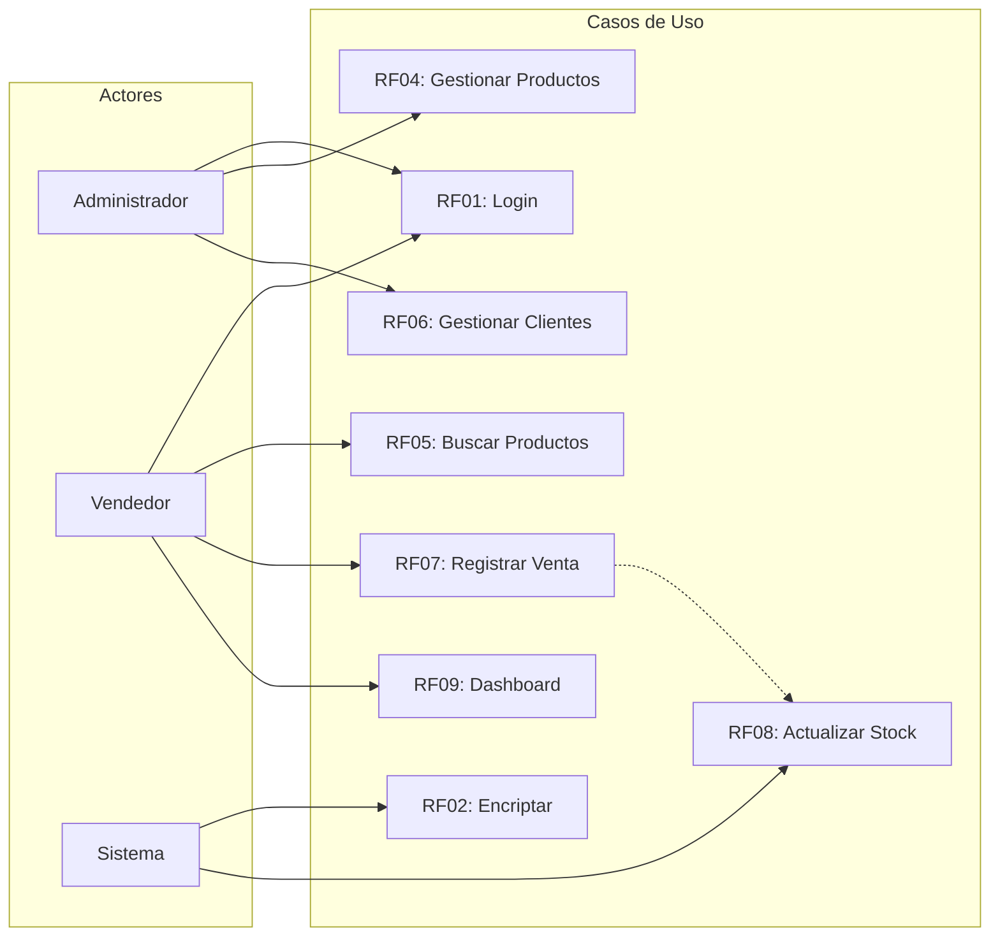

# Diagrama de Casos de Uso - Sistema Nova Salud

```mermaid
graph LR
  subgraph Actores
    A[Administrador]
    V[Vendedor]
    S[Sistema]
  end

  subgraph Casos de Uso
    B[RF01: Login]
    C[RF04: Gestionar Productos]
    D[RF06: Gestionar Clientes]
    F[RF05: Buscar Productos]
    G[RF07: Registrar Venta]
    H[RF09: Dashboard]
    J[RF02: Encriptar]
    K[RF08: Actualizar Stock]
  end

  A --> B & C & D
  V --> B & F & G & H
  S --> J & K
  G -.-> K
```