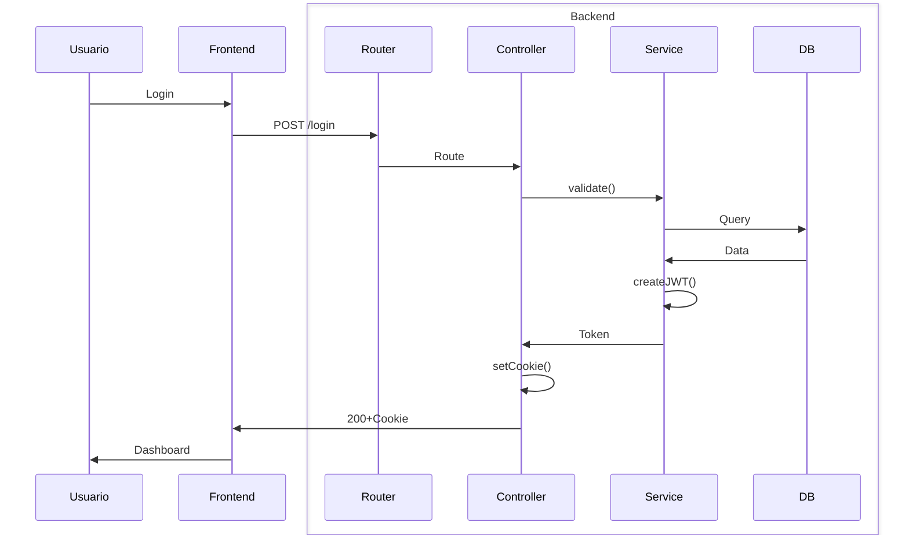
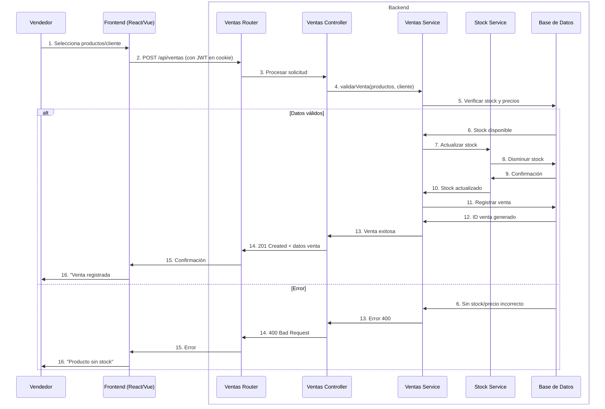
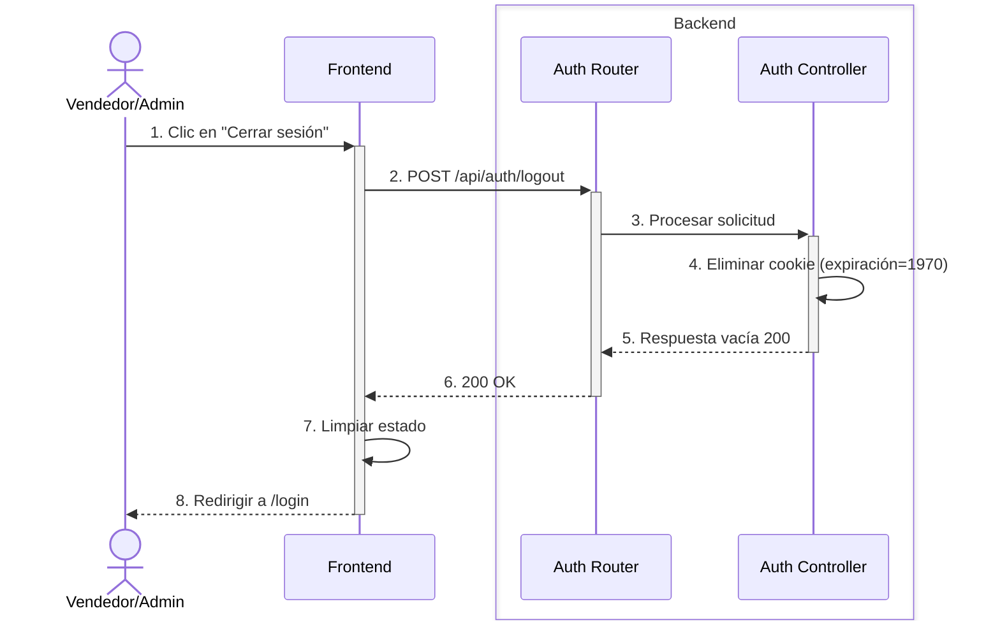

# Diagrama de Secuencias - Sistema Nova Salud

## Proceso de login

```mermaid
sequenceDiagram
    participant U as Usuario
    participant F as Frontend
    box Backend
        participant R as Router
        participant C as Controller
        participant S as Service
        participant D as DB
    end

    U->>F: Login
    F->>R: POST /login
    R->>C: Route
    C->>S: validate()
    S->>D: Query
    D->>S: Data
    S->>S: createJWT()
    S->>C: Token
    C->>C: setCookie()
    C->>F: 200+Cookie
    F->>U: Dashboard
```
 

---

 

## Proceso de compra

```mermaid
sequenceDiagram
    participant Usuario as Vendedor
    participant Frontend as Frontend (React/Vue)
    box Backend
        participant Router as Ventas Router
        participant Controller as Ventas Controller
        participant Service as Ventas Service
        participant Stock as Stock Service
        participant DB as Base de Datos
    end

    Usuario->>Frontend: 1. Selecciona productos/cliente
    Frontend->>Router: 2. POST /api/ventas (con JWT en cookie)
    Router->>Controller: 3. Procesar solicitud
    
    %% Validación
    Controller->>Service: 4. validarVenta(productos, cliente)
    Service->>DB: 5. Verificar stock y precios
    alt Datos válidos
        DB->>Service: 6. Stock disponible
        Service->>Stock: 7. Actualizar stock
        Stock->>DB: 8. Disminuir stock
        DB->>Stock: 9. Confirmación
        Stock->>Service: 10. Stock actualizado
        Service->>DB: 11. Registrar venta
        DB->>Service: 12. ID venta generado
        Service->>Controller: 13. Venta exitosa
        Controller->>Router: 14. 201 Created + datos venta
        Router->>Frontend: 15. Confirmación
        Frontend->>Usuario: 16. "Venta registrada #123"
    else Error
        DB->>Service: 6. Sin stock/precio incorrecto
        Service->>Controller: 13. Error 400
        Controller->>Router: 14. 400 Bad Request
        Router->>Frontend: 15. Error
        Frontend->>Usuario: 16. "Producto sin stock"
    end
```

---

 

## Proceso de cerrar sesion

```mermaid
sequenceDiagram
    actor Usuario as Vendedor/Admin
    participant Frontend as Frontend
    box Backend
        participant Router as Auth Router
        participant Controller as Auth Controller
    end

    Usuario->>+Frontend: 1. Clic en "Cerrar sesión"
    Frontend->>+Router: 2. POST /api/auth/logout
    Router->>+Controller: 3. Procesar solicitud
    
    %% Eliminación directa
    Controller->>Controller: 4. Eliminar cookie (expiración=1970)
    Controller-->>-Router: 5. Respuesta vacía 200
    Router-->>-Frontend: 6. 200 OK
    
    Frontend->>Frontend: 7. Limpiar estado
    Frontend-->>-Usuario: 8. Redirigir a /login
```